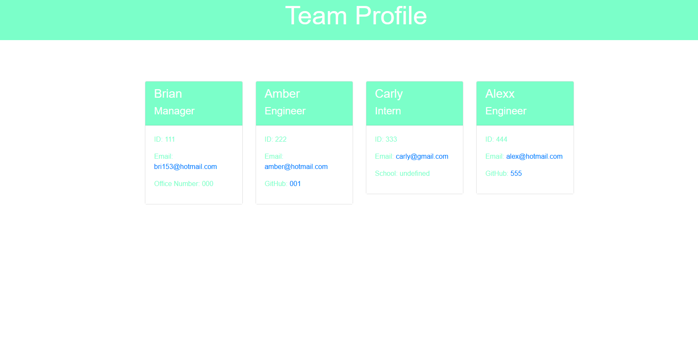

<h1 align="center">Team Profile Generator</h1> 

## Description
This application was built with Node.js. It is a command line application that takes information about employees & interns on a software engineering team. After answering multiple questions, this application will generate an HTML webpage that displays summaries for each employee/intern. 
  
   
   

## Technologies
  * JavaScript
  * Node.js
  * Jest
  * Inquirer
   

## Table of Contents
  
  1. [ Installation ](#installation)
  2. [ Usage ](#usage)
  3. [ Screenshot ](#screenshot)
  4. [ License ](#license)

## User Story
AS A manager 
I WANT to generate a webpage that displays my team's basic info 
SO THAT I have quick access to their emails and GitHub profiles

## Acceptance Criteria
GIVEN a command-line application that accepts user input 
WHEN I am prompted for my team members and their information 
THEN an HTML file is generated that displays a nicely formatted team roster based on user input 
WHEN I click on an email address in the HTML 
THEN my default email program opens and populates the TO field of the email with the address 
WHEN I click on the GitHub username 
THEN that GitHub profile opens in a new tab 
WHEN I start the application 
THEN I am prompted to enter the team manager’s name, employee ID, email address, and office number 
WHEN I enter the team manager’s name, employee ID, email address, and office number 
THEN I am presented with a menu with the option to add an engineer or an intern or to finish building my team 
WHEN I select the engineer option 
THEN I am prompted to enter the engineer’s name, ID, email, and GitHub username, and I am taken back to the menu 
WHEN I select the intern option 
THEN I am prompted to enter the intern’s name, ID, email, and school, and I am taken back to the menu 
WHEN I decide to finish building my team 
THEN I exit the application, and the HTML is generated
  
  

## Installation
First clone this repository & type "npm i" in the terimanl. From there you will install Node.js to your computer. Once installed, type "node index.js" in the terminal. Answer all of the prompts to generate a index.html file. The new index.html file will be located in a folder called "dist" in the root directory.
  

## Usage
View video walkthrough on how to use this application by clicking [here](https://drive.google.com/file/d/1HSfNE8VwWTKqD7WeNsrs2kksJ2Gye4R3/view)

## Screenshot

  

## License
 
This project is licensed under the MIT License - see the [license info](https://opensource.org/licenses/MIT) for more details.
  
